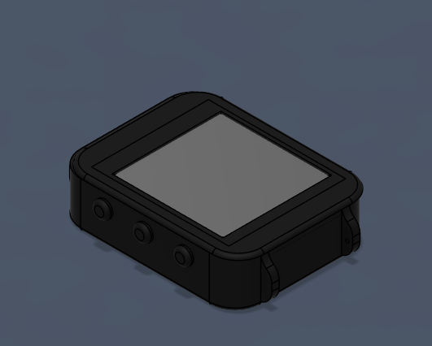
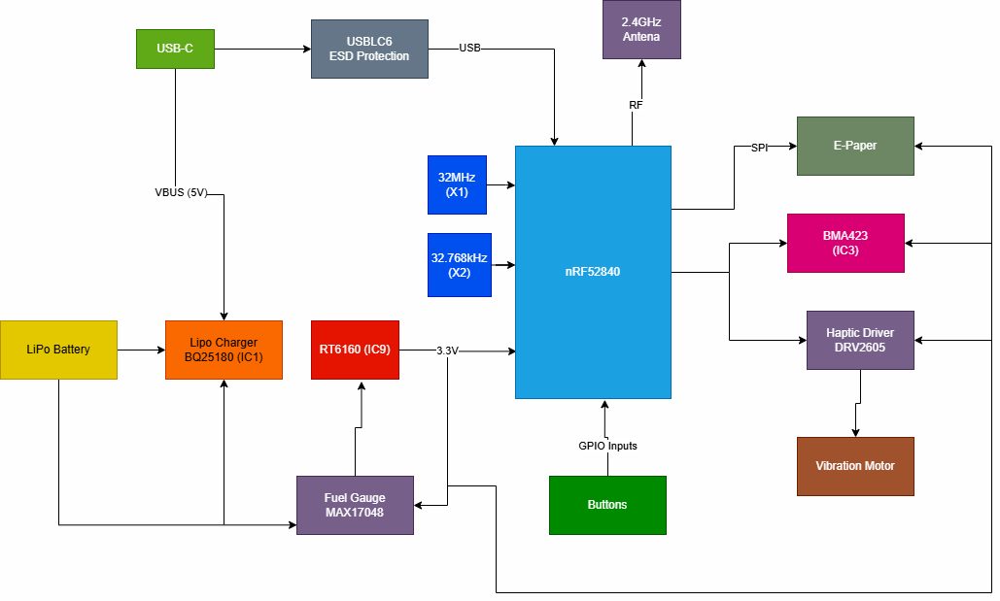
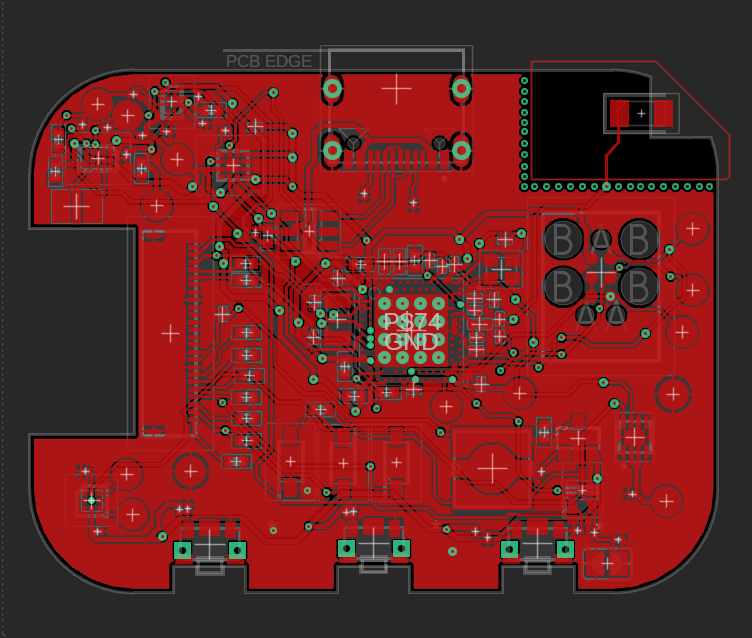
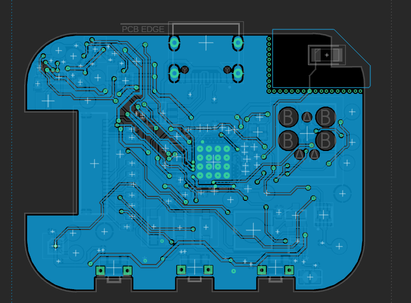

# SmartWatch

Un smartwatch open-source accesibil, construit în jurul microcontrolerului **nRF52840**, cu afișaj **e-paper**, consum redus de energie și conectivitate **Bluetooth Low Energy**.



## Diagramă Bloc



---

## Bill of Materials (BOM)

Tabelul de mai jos conține principalele componente utilizate în proiect, împreună cu capsulele lor, rolul funcțional și link-uri către documentația tehnică unde este disponibilă.

| Componentă | Valoare / Part Number | Pachet | Cant. | Rol | Datasheet |
|-----------|------------------------|--------|-------|-----|-----------|
| NRF52840_QF | nRF52840 | AQFN-73 | 1 | Microcontroler principal cu BLE 5.0 | [Datasheet](https://infocenter.nordicsemi.com/pdf/nRF52840_PS_v1.1.pdf) |
| IC1 | RT6160AWSC | WL-CSP-15 | 1 | Convertor buck-boost DC/DC | [Datasheet](https://www.richtek.com/assets/product_file/RT6160A/DS6160A-05.pdf) |
| IC2 | BMA423 | LGA-12 | 1 | Accelerometru triaxial | [Datasheet](https://www.bosch-sensortec.com/products/motion-sensors/accelerometers/bma423/) |
| IC3 | BQ25180YBGR | DSBGA-8 | 1 | Încărcător pentru baterie LiPo | [Datasheet](https://www.ti.com/lit/ds/symlink/bq25180.pdf) |
| IC4 | DRV2605YZFR | WCSP-9 | 1 | Driver haptic | [Datasheet](https://www.ti.com/lit/ds/symlink/drv2605.pdf) |
| U1 | MAX17048G+T10 | TDFN-8 | 1 | Fuel gauge pentru monitorizarea bateriei | [Datasheet](https://www.analog.com/media/en/technical-documentation/data-sheets/max17048-max17049.pdf) |
| D3 | USBLC6-2SC6Y | SOT-23-6 | 1 | Protecție ESD pentru liniile USB | [Datasheet](https://www.st.com/resource/en/datasheet/usblc6-2.pdf) |
| ANT1 | 2450AT18B100E | SMD | 1 | Antenă chip 2.4GHz | [Datasheet](https://www.johansontechnology.com/datasheets/antennas/2450AT18B100.pdf) |
| X1 | Cristal 32MHz | SMD 2016 | 1 | Sursă principală de ceas | - |
| X2 | Cristal 32.768kHz | SMD 3215 | 1 | Sursă de ceas pentru RTC | - |
| J1 | TC2030-IDC | Tag-Connect | 1 | Interfață SWD pentru programare și debugging | [Datasheet](https://www.tag-connect.com/product/tc2030-idc) |
| J2 | 503480-2400 | FPC-24 | 1 | Conector pentru afișajul e-paper | [Datasheet](https://www.molex.com/en-us/part-list/503480-2400) |
| J4 | KH-TYPE-C-16P | SMD | 1 | Conector USB-C | - |
| Q1 | DMG2305UX-7 | SOT-23 | 1 | MOSFET P-channel pentru circuitul EPD | [Datasheet](https://www.diodes.com/assets/Datasheets/DMG2305UX.pdf) |
| Q3 | SI1308EDL-T1-GE3 | SC-70 | 1 | MOSFET N-channel pentru circuitul EPD | [Datasheet](https://www.vishay.com/docs/68986/si1308edl.pdf) |
| D2, D4, D5 | MBR0530 | SOD-123 | 3 | Diode Schottky pentru etajul EPD | - |
| L1 | 3.9nH | SMD 2012 | 1 | Element din rețeaua RF de adaptare | - |
| L2 | 10µH | SMD 2012 | 1 | Inductor pentru alimentarea nRF | - |
| L3 | 15nH | SMD 2012 | 1 | Filtru RF | - |
| L5 | 68µH | SMD 2012 | 1 | Inductor pentru generatorul EPD | - |
| L7 | FTC252012SR47MBCA | SMD 2012 | 1 | Inductor de putere pentru RT6160 | [JLCPCB](https://jlcpcb.com/partdetail/6763488-FTC252012SR47MBCA/C5832368) |
| SW_UP, SW_DN, SW_ENT | EVP-AKE31A | SMD | 3 | Butoane tactile | - |
| SJ1 | Solder Jumper | SMD | 1 | Jumper de configurare | - |
| R1, R2, R5 | 0Ω | 0201 | 3 | Rezistențe de configurare | - |
| R3, R4 | 3.3kΩ | 0201 | 2 | Pull-up pentru magistrala I2C | - |
| R6, R2_EP_DR, R_PWR_EPD | 10kΩ | 0201 | 3 | Pull-up / pull-down | - |
| R7, R8, R9 | 10kΩ | 0201 | 3 | Pull-down pentru butoane | - |
| R1_USB, R2_USB | 5.1kΩ | 0201 | 2 | Rezistențe CC pentru USB-C | - |
| R_TYPE_SEL | 2.2Ω | 0201 | 1 | Selecție tip display | - |
| R1_EP_DR | 0.47Ω | 0201 | 1 | Limitare / sensing în etajul EPD | - |
| C1, C2, C17, C18 | 12pF | 0201 | 4 | Condensatoare pentru cristale | - |
| C3, C4 | 1pF | 0201 | 2 | Condensatoare pentru adaptare RF | - |
| C9 | 820pF | 0201 | 1 | Condensator de adaptare RF | - |
| C5, C7, C8, C12, C19 | 100nF | 0201 | 5 | Decuplare locală | - |
| C11 | 100pF | 0201 | 1 | Decuplare DEC5 | - |
| C16 | 47nF | 0201 | 1 | Decuplare | - |
| C15 | 1.0µF | 0402 | 1 | Decuplare | - |
| C6, C14, C20, C21, C43, C2-EP-DR | 4.7µF | 0402 | 6 | Condensatoare bulk | - |
| C24, C39, C1-EP-DR | 10µF | 0402 | 3 | Filtrare intrare / ieșire | - |
| C25, C33 | 22µF | 0402 | 2 | Condensatoare ieșire convertor | - |
| C23, C27, C34, C42, EPD_C5 | 0.1µF | 0201 | 5 | Bypass / decuplare | - |
| C29-C32, C37, C38, EPD_C1-C12 | 1µF | 0402 | 15 | Filtrare și stabilizare | - |
| C10, C13, C22 | N.C. | 0201 | 3 | Nepopulate | - |
| Test Pads | - | SMD | 14 | Puncte de test pentru alimentare și debug | - |

---

## Hardware

### Microcontroler principal — nRF52840

Microcontrolerul **nRF52840** reprezintă centrul funcțional al întregului sistem. Acesta asigură procesarea principală, comunicația **Bluetooth Low Energy 5.0**, gestionarea perifericelor și controlul semnalelor digitale necesare funcționării ceasului. Cipul integrează un nucleu **ARM Cortex-M4F** care rulează la **64 MHz**, suficient pentru aplicația vizată, păstrând în același timp un consum redus.

Comunicarea cu restul blocurilor hardware este împărțită astfel:
- **SPI** pentru afișajul e-paper
- **I2C** pentru accelerometru, fuel gauge, încărcător, convertorul DC/DC și driverul haptic
- **GPIO** pentru butoane, semnale de control și linii de întrerupere
- **USB** pentru comunicație și alimentare
- **SWD** pentru programare și depanare

Microcontrolerul este alimentat la **3.3V** din convertorul **RT6160**.

Sursa principală de tact este un cristal de **32 MHz**, conectat la pinii dedicați ai nRF52840. Pentru funcții de timp real și moduri low-power este folosit și un cristal de **32.768 kHz**.

Partea RF este construită în jurul antenei **2450AT18B100E**, conectată la pinul ANT printr-o rețea de adaptare de impedanță formată din **L1, C3, C4 și C9**. Antena a fost poziționată la marginea plăcii, iar în zona de sub aceasta a fost menținut un keepout de cupru pentru a nu afecta performanța radio.

Condensatoarele de decuplare au fost amplasate cât mai aproape de pinii de alimentare, urmând recomandările din designul de referință Nordic.

### Managementul alimentării

#### Încărcător LiPo — BQ25180

Circuitul **BQ25180** se ocupă de încărcarea bateriei LiPo din sursa USB-C. Tensiunea de intrare este preluată de pe linia **VBUS**, iar bateria este conectată pe linia **VBAT**. Acest circuit poate fi configurat prin **I2C**, iar ieșirea sa de întrerupere este conectată la microcontroler pentru semnalizarea evenimentelor de alimentare.

#### Convertor buck-boost — RT6160

Pentru a obține o tensiune stabilă de **3.3V** indiferent de variația tensiunii bateriei, proiectul folosește convertorul **RT6160**. Acesta transformă tensiunea bateriei într-o sursă reglată pentru întreaga logică digitală. Convertorul este conectat la magistrala **I2C**, fiind însoțit de bobina externă și condensatoarele de intrare și ieșire necesare funcționării corecte.

#### Fuel gauge — MAX17048

Circuitul **MAX17048** are rolul de a monitoriza bateria și de a estima starea de încărcare. Acesta comunică prin **I2C**, iar semnalul **ALERT** este dus la un GPIO al microcontrolerului, pentru a permite tratarea rapidă a evenimentelor legate de baterie.

### Afișaj — e-paper 1.54"

Interfața vizuală a ceasului este asigurată de un afișaj **e-paper de 1.54 inch**, cu rezoluție **200 × 200 pixeli**, conectat printr-un conector FPC. Transferul de date se face pe magistrala **SPI**, folosind liniile **MOSI**, **SCK** și **EPD_CS**.

Pe lângă acestea, afișajul mai folosește și semnale GPIO dedicate:
- **EPD_DC**
- **EPD_RST**
- **EPD_BUSY**

Pentru că panoul e-paper are nevoie de tensiuni speciale pentru refresh, a fost introdus un etaj dedicat de generare a tensiunilor, construit cu **Q1**, **Q3**, **D2/D4/D5**, **L5** și mai mulți condensatori. Acest bloc generează liniile **PREVGH** și **PREVGL** necesare funcționării afișajului.

### IMU — BMA423

Pentru detectarea mișcării, proiectul utilizează **BMA423**, un accelerometru triaxial cu consum redus. Acesta este conectat la microcontroler prin **I2C** și oferă două ieșiri de întrerupere, **IMU_INT1** și **IMU_INT2**, utilizabile pentru funcții precum detectarea mișcării, a pașilor sau trezirea sistemului.

### Driver haptic — DRV2605

Feedback-ul tactil este realizat prin circuitul **DRV2605**, care comandă motorul de vibrație. Acesta comunică prin **I2C** și este activat prin semnalul **HAPTIC_EN** controlat de microcontroler.

### USB-C și protecție ESD

Conectorul **USB-C** este folosit atât pentru alimentare, cât și pentru comunicație USB. Liniile de date sunt protejate cu circuitul **USBLC6**, iar pinii **CC** sunt configurați prin rezistențe de **5.1kΩ**, astfel încât portul să fie recunoscut corect în modul device.

### Interfață de debugging — SWD

Programarea și depanarea sunt realizate printr-un conector **Tag-Connect TC2030**, care expune semnalele:
- **SWDIO**
- **SWDCLK**
- **SWO**
- **RESET**
- **3.3V**
- **GND**

Această soluție elimină necesitatea unui header permanent și ajută la păstrarea unui format compact al plăcii.

---

## Mapare pini nRF52840

Tabelul următor prezintă rolul principal al pinilor utilizați pe microcontrolerul nRF52840 în cadrul proiectului.

| Pin | Semnal | Funcție | Interfață |
|-----|--------|---------|-----------|
| P0.00 / XL1 | XL1 | Intrare cristal 32.768kHz | Clock |
| P0.01 / XL2 | XL2 | Ieșire cristal 32.768kHz | Clock |
| P0.04 / AIN2 | IMU_INT1 | Întrerupere 1 de la accelerometru | GPIO |
| P0.05 / AIN3 | IMU_INT2 | Întrerupere 2 de la accelerometru | GPIO |
| P0.06 | EPD_CS | Chip Select pentru e-paper | SPI |
| P0.07 | EPD_DC | Selectare date / comandă display | GPIO |
| P0.08 | EPD_RST | Reset pentru display | GPIO |
| P0.09 / NFC1 | PMIC_INT | Întrerupere de la BQ25180 | GPIO |
| P0.11 | SCK | Clock SPI pentru e-paper | SPI |
| P0.12 | MOSI | Linie date SPI pentru e-paper | SPI |
| P0.13 | EPD_BUSY | Semnal busy de la display | GPIO |
| P0.14 | SCL | Clock magistrală I2C | I2C |
| P0.15 | SDA | Linie date magistrală I2C | I2C |
| P0.18 / RESET | RESET | Reset sistem | Reset |
| P0.19 | HAPTIC_EN | Enable pentru driverul haptic | GPIO |
| P0.26 | SW_UP | Buton sus | GPIO |
| P0.27 | SW_DN | Buton jos | GPIO |
| P1.00 | SW_ENT | Buton enter / select | GPIO |
| P1.01 | ALERT | Alertă de la MAX17048 | GPIO |
| P1.09 | SWO | Debug trace output | Debug |
| XC1 / XC2 | Crystal | Cristal 32MHz | Clock |
| ANT | RF | Antenă prin rețea de adaptare | RF |
| VBUS | USB_VBUS | Alimentare USB 5V | Power |
| D+ / D- | USB Data | Linii de date USB | USB |
| SWDIO | Debug | Linie date SWD | Debug |
| SWDCLK | Debug | Linie clock SWD | Debug |

**Magistrala I2C** este comună pentru:
- **BMA423**
- **BQ25180**
- **RT6160**
- **DRV2605**
- **MAX17048**

Liniile **SDA** și **SCL** sunt trase la **3.3V** prin rezistențele **R3** și **R4**.

---

## Detalii design PCB

### Specificații generale

- **Dimensiuni placă:** 46 mm × 35 mm
- **Formă:** colțuri rotunjite
- **Număr de straturi:** 2
- **Straturi folosite:** Top și Bottom
- **Grosime PCB:** 1.0 mm
- **Lățime trasee semnal:** 0.15 mm
- **Lățime trasee putere:** 0.3 mm
- **Montaj componente:** exclusiv pe stratul Top

### Organizarea straturilor

Placa a fost proiectată pe **două straturi**, iar ambele straturi includ și **zone de plan de masă (GND pour)** pentru a îmbunătăți returul de curent, stabilitatea electrică și comportamentul EMI.

| Strat | Rol principal |
|-------|---------------|
| Top | rutare semnale, plasare componente, plan GND |
| Bottom | rutare suplimentară și plan GND |

### Decizii de proiectare și erori acceptate

În timpul proiectării au existat anumite avertismente DRC care au fost analizate manual și acceptate, deoarece rezultau din constrângeri reale de spațiu sau din cerințe mecanice.

#### Erori de lățime traseu

Pentru liniile de putere precum **3V3**, **VBAT**, **VBUS** sau alte rețele similare, regula de proiectare impunea o lățime de **0.3 mm**. În anumite zone foarte aglomerate ale plăcii, mai ales în apropierea capsulelor fine și a grupurilor dense de componente pasive, această lățime nu a putut fi păstrată pe întreaga lungime, astfel că unele segmente scurte au fost rutate mai îngust. Aceste cazuri au fost acceptate.

#### Erori de clearance

În unele regiuni compacte, în special în jurul microcontrolerului și în zonele cu densitate mare de trasee, anumite segmente de cupru au ajuns mai aproape decât clearance-ul ideal. Aceste situații au fost verificate manual și nu au indicat existența unor scurtcircuite reale.

#### Avertismente legate de planele GND

Fiindcă atât pe Top, cât și pe Bottom au fost folosite planuri de masă, anumite mesaje de clearance sau suprapunere au apărut între zone care aparțin aceleiași rețele **GND**. Aceste avertismente nu afectează funcționarea electrică a plăcii.

#### Extindere peste conturul plăcii

Butoanele tactile și conectorul USB-C sunt poziționate astfel încât să iasă parțial în afara conturului PCB-ului. Acest lucru a fost făcut intenționat pentru alinierea cu decupajele carcasei.

#### Componente nepopulate

Anumite condensatoare marcate **N.C.** sau **DNP** au rămas în schemă și layout pentru compatibilitate cu designul de referință, dar nu sunt montate în varianta finală.

#### Vias de masă și continuitate GND

Au fost adăugate mai multe căi de masă distribuite pe placă pentru a îmbunătăți continuitatea între planele GND și pentru a oferi trasee de retur mai bune, mai ales în jurul zonei RF și a microcontrolerului.

---

## Design PCB

Layout-ul plăcii a fost realizat cu accent pe compactitate, integrare mecanică și păstrarea unor rute cât mai clare între blocurile funcționale. Toate componentele au fost montate pe stratul **Top**, ceea ce simplifică asamblarea și reduce complexitatea mecanică.

Microcontrolerul a fost poziționat central pentru a facilita distribuția semnalelor către afișaj, senzori, partea de alimentare și interfața de debugging. Blocurile de alimentare au fost păstrate relativ aproape unele de altele pentru a minimiza lungimea traseelor de putere, iar zona RF a fost plasată la marginea plăcii pentru a permite funcționarea corectă a antenei.

În realizarea layout-ului au fost urmărite următoarele principii:
- trasee scurte pentru alimentare și decuplare
- gruparea componentelor pe funcții
- separarea cât mai clară a zonei RF de restul circuitului
- acces mecanic bun pentru USB-C și butoane
- folosirea planurilor GND pe ambele straturi pentru integritate electrică mai bună

Imaginile cu stratul superior și cel inferior sunt incluse în secțiunea de imagini a repository-ului pentru a evidenția modul de rutare și distribuția componentelor.
| Top Layer | Bottom Layer |
|:---:|:---:|
|  |  |

---

## Design schematic

Schema electrică a fost organizată modular, astfel încât fiecare subsistem important să poată fi urmărit separat și ușor de înțeles. Proiectul include blocuri distincte pentru:
- microcontroler și tact
- alimentare și încărcare baterie
- monitorizare baterie
- afișaj e-paper și etajul său de comandă
- accelerometru
- driver haptic
- interfață USB
- interfață SWD

Această structurare ajută atât în faza de proiectare, cât și în etapa de verificare și review. Conexiunile dintre blocuri sunt realizate coerent, iar magistralele principale, cum ar fi **I2C** și **SPI**, sunt evidențiate clar în schemă.

De asemenea, schema conține și componente auxiliare importante:
- rezistențe de pull-up și pull-down
- condensatoare de decuplare și filtrare
- elemente de adaptare RF
- conectori și puncte de test

Capturile de ecran ale schemei sunt incluse în repository pentru a susține documentația hardware.

---

## Structura repository-ului

Structura proiectului este organizată astfel încât fișierele de proiectare, fabricație, randare și documentare să fie ușor de identificat.

```text
├── Hardware/
│   ├── InkTime_Schematic.sch
│   └── InkTime_Board.brd
├── Manufacturing/
│   ├── gerbers.zip
│   ├── InkTime_BOM.bom
│   └── InkTime_PnP.cpl
├── Mechanical/
│   ├── InkTime_step.step
│   └── InkTime_complete.f3z
├── Images/
│   ├── 2D_PCB/
│   ├── 3D_PCB/
│   ├── InkTime/
│   └── Schematic/
├── LICENSE
└── README.md
